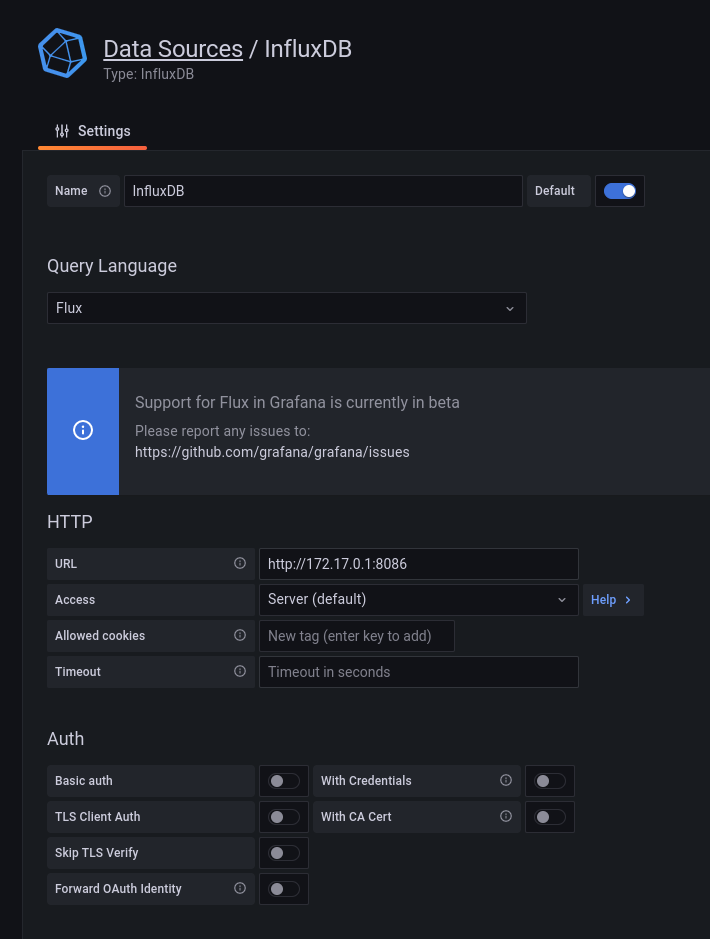

# Water quality monitor - server

Everyting runs inside docker containers - all you need is to run `start_server.sh` and it'll start.
You'll need to configure Grafana and InfluxDB manually.
The section below may help you with it
### Configuring InfluxDB
TODO

For now, you can try it on your own - it's not that hard.
Just make sure your bucket has some reasonable data retention.
You'll also need to generate an acces token

### Configuring Grafana
Firstly, you'll need to configure a new data source - InfluxDB. 
The configuration is as follows:

You'll also need to configure your credentials, enter what you've previously set or generated

Create a panel for every measured parameter - O2, ORP, PH, temperature and clarity.
When enetering a query, type the following lines
```influxQL
from(bucket: "BUCKET NAME")
  |> range(start: v.timeRangeStart, stop: v.timeRangeStop)
  |> filter(fn: (r) => r["_measurement"] == "kvalita-vody")
  |> filter(fn: (r) => r["_field"] == "PARAMETER")
  |> filter(fn: (r) => r["location"] == "YOUR LOCATION")
  |> aggregateWindow(every: v.windowPeriod, fn: mean, createEmpty: false)
  |> yield(name: "mean")
```
Change the values above written in CAPS to fit your own situation.
You can also configure other parameters, namely time range for the entire dashboard.
After creating all pannels, make sure to save your dashboard. 

To get a link to your pannel, go to your dashboard, click on your pannel's name and choose share.
From there, click embed. You'll see an HTML tag `<iframe>`with some parameters.
Copy the link in `src="https://www.example.com/something"`. Don't copy the quotes, only copy the link.
Also, in the link, remove the part which says `&from=123456789&to=123456789`.
If left it, it will cause the time range to remain static, which is not the desired effect.

You'll need the link for the following part.

On the machine where you installed the server, run the following command:
```
docker exec -ti kvalita-vody-web_server-1 set_iframes
```
If it cannot find the given container, run `docker ps` and take the container name from there.

In the script, you'll interactively set each of the graph links.
Choose which link to modify and then paste the corresponding link.
When you're done, instead of entering the number, type `q` and then `y`.

Lastly, restart the container by running `docker compose restart` in the directory where `docker-compose.yml is located.
